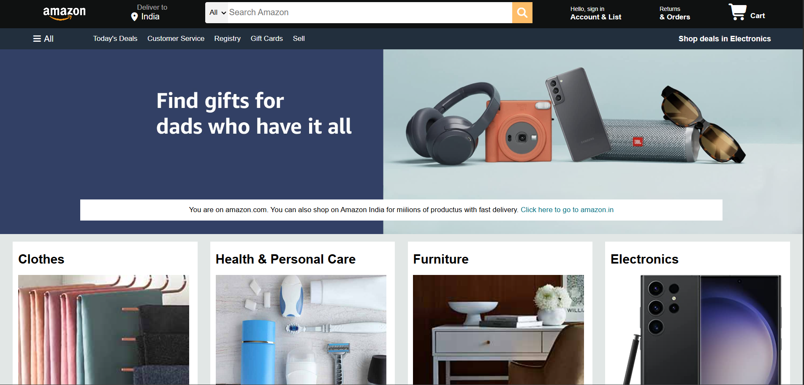

# 🛒 Amazon Clone

A responsive front-end clone of the Amazon homepage built using HTML and CSS.

---

## 📖 Description

This project is a static clone of the Amazon website's homepage, created to practice and strengthen front-end web development skills. It replicates the layout and design of Amazon, including the navigation bar, search bar, hero section, product categories, and footer.

The project focuses on responsive design, CSS styling, flexbox, and layout structuring using pure HTML and CSS.

---

## ✨ Features

- 🛍️ Amazon-inspired homepage design
- 🔍 Search bar and navigation menu
- 🖼️ Hero banner section
- 📦 Product category cards
- 📱 Responsive layout
- 🎨 Clean and organized CSS styling

---

## 🛠️ Technologies Used

- HTML5
- CSS3

---

## 📂 Project Structure

```text
Amazon-Clone/
├── index.html
├── style.css
├── images/
└── README.md
```

---

## 🚀 How to Run the Project

1. Clone the repository:

   ```bash
   git clone https://github.com/zishan4hmed/Amazon-Clone.git
   ```

2. Open the project folder.

3. Double-click `index.html` or open it in any web browser.

4. Explore the Amazon homepage clone.

---

## 🌐 Live Demo

You can host this project using GitHub Pages and add the link here:

```text
https://zishan4hmed.github.io/Amazon-Clone/
```

---

## 📸 Screenshot

Add a screenshot named `screenshot.png` to your repository and use:

```markdown

```

---

## 🎯 Learning Outcomes

Through this project, I practiced:

- HTML page structuring
- CSS positioning and layout
- Flexbox
- Responsive web design
- UI replication from a real-world website

---

## 🔮 Future Improvements

- Add JavaScript functionality
- Make all sections fully responsive
- Implement shopping cart features
- Integrate product pages

---

## 👨‍💻 Author

**Zishan Ahmad**  
B.Tech Computer Science Student at Galgotias University

- GitHub: https://github.com/zishan4hmed
- LinkedIn: https://www.linkedin.com/in/zishan-ahmad-4383092a8/

---

## 📜 License

This project is created for educational purposes only. It is not intended for commercial use and is not affiliated with Amazon.

---

## ⭐ Support

If you like this project, consider giving it a ⭐ on GitHub.